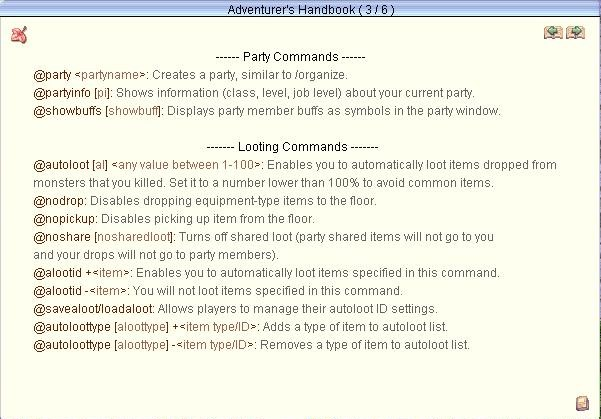
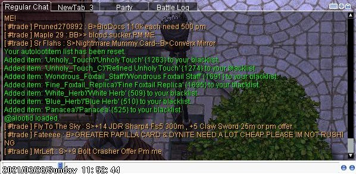

# farming.md

## Overview

```
@help
```



## M2 settings



## Geffenia settings

```
@alootid - 1919
@alootid - 12020
@savealoot
```

Add to ignore:
- base guitar (10 z, w 150) # 1919
- cursed water (1 z, w 3) # 12020
- evil wing # 2255
- Ahlspiess # 1478 # 1488
- Battle Hook # 1421

## Apply settings

```
@loadaloot
```
